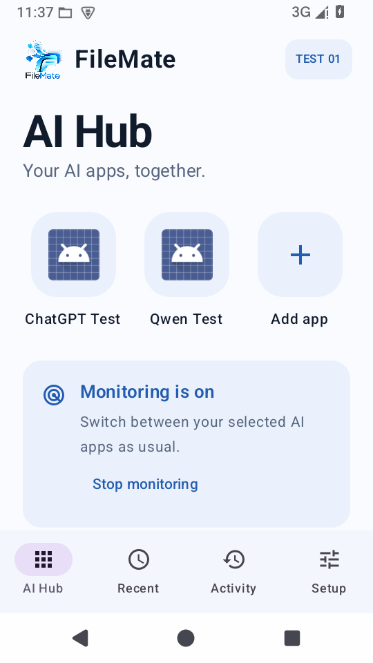
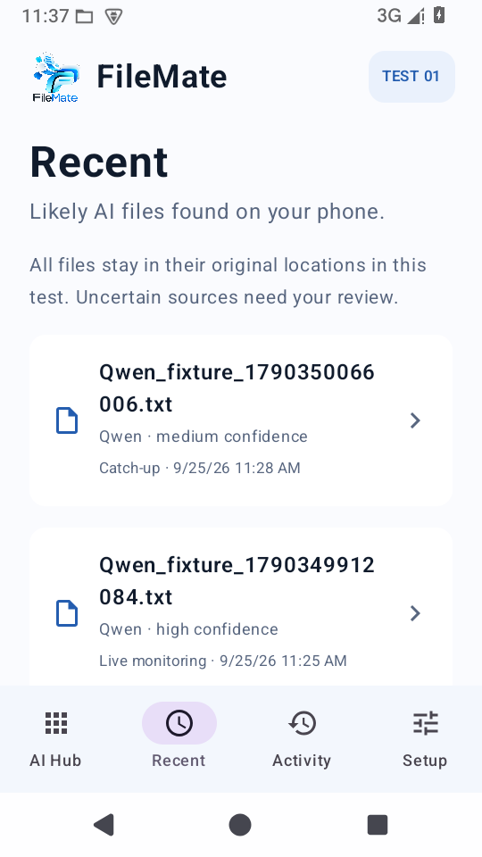

# Runtime verification

## Current result — 27 September 2026

The corrected 0.1.1 proof has now passed the real production inactivity interval. [Public run 36285379397](https://github.com/KpDaze/FileMate-Public/actions/runs/36285379397) used a standard public `ubuntu-latest` runner, KVM and Android 15/API 35. Java/Gradle build and JVM tests passed, FileMate installed, its monitoring service recorded `session_active=true`, and it remained active at the at-least-29-minute check. It then stopped automatically; the harness verified the Activity entry and removal of the monitoring notification.

The harness reports 1785 seconds after a separate 25-second setup delay, so actual service life crosses the intended approximately 30-minute boundary. It did not alter the device clock or shorten the production timeout. This successful public run supersedes the earlier interrupted inactivity attempts below while preserving them as historical evidence.

The public run did not add two real provider apps through the picker, use provider accounts, test their downloads, or prove physical-phone permissions and battery behaviour. The earlier Android 15 fixture run separately covers ordinary Qwen → ChatGPT → Qwen switching and live MediaStore exports.

Kel installed the corrected personal APK on a physical phone on 27 September. Installation and the screens tried appeared to work. The later broad-access setup was left incomplete, so the physical-phone acceptance gate remains partial.

Private signing and recovery records are intentionally outside this public repository. The four private recovery files omitted from the public snapshot are not required to build the public source.

## Earlier corrected-build verification — 25 September 2026

## Corrected build: 0.1.1-proof

Source: `1a4d6c8d18a2e4ee77cb5d56d55da075cc3ff1c4`. Version code 2. Emulator candidate SHA-256: `3fe53f18047a668239c6fd6fd4348baaf8ebc7eee69829625bdd6cf3b7efd970`.

The corrected Hub launch has passed on Android 15. This candidate is signed with an existing disposable fixture key for emulator validation only. It is not the user-facing APK. Kel later confirmed that no APK had been installed. A fresh first-install key is now backed up and the same payload signed for delivery; see the 26 September follow-up below.

### Environment and setup

Full AOSP Android 15 / API 35, x86_64, software emulation without KVM, SwiftShader, 540 × 960 at 240 dpi (360 × 640 dp). Installation was held until package, activity and shared Downloads access were available. Readiness took 926 seconds. Android briefly reported boot complete while shared storage was still unavailable; that recovered without remounting, formatting or clearing storage. System UI stalled once during initial app startup and recovered after Wait. Bluetooth was disabled after repeated emulator service failures. These results are functional checks, not performance measurements.

Two synthetic installed apps, Qwen Test and ChatGPT Test, export actual files through Android MediaStore Downloads. They have no provider accounts or network calls. The corrected run granted file/usage/notification access with adb and seeded only the two Hub choices into an otherwise empty test database. Permission screens and choosing apps through the installed-app picker were exercised on the original APK; those screens and permissions did not change in the correction. The original picker listed ordinary launchable apps as well as the fixtures, rather than a fixed list of AI providers.

### Observed corrected results

| Check | Result and evidence |
| --- | --- |
| Build and logic tests | Build passed; 8 JVM tests passed, zero failures/errors/skips |
| Package integrity | v3 signature and 16 KB ZIP alignment verified; all 74 packaged entries match the Gradle output; no INTERNET permission |
| Launch Qwen from Hub | Passed; fixture Activity visibly opened, after Monitoring started in local history |
| Launch ChatGPT from Hub | Passed on a second session; fixture Activity visibly opened |
| Detect live export in background | Qwen-named file recorded High / Live monitoring before FileMate was reopened |
| Exclude unrelated receipt | Receipt absent from observations; ignored count 1 |
| Handle ambiguous notes | Notes recorded Low, with timing-only explanation; shared file unchanged |
| Continue while switching | Qwen → ChatGPT → Qwen, returning through Android Recent Apps; all named exports recorded live before reopening FileMate |
| Stop manually | Session became inactive; notification 44 disappeared |
| Catch a missed export | Off-session file did not appear live; reopening added it as Medium / Catch-up, count 4 → 5 |
| Reopen without duplicate records | Count stayed 5 |
| Preserve shared files | All six original filenames remain in Downloads/FileMateTests; content hashes match the original fixture exports |
| Full 30-minute inactivity | **Earlier attempt inconclusive**: active at 728 seconds, then execution/emulator control sessions became unavailable. Superseded by public run 36285379397. |
| Real providers / physical phone | Partial physical-phone check on 27 September; full provider/file test remains pending |

[Corrected observations, history and check status](runtime-evidence/2026-09-25/corrected-results.json) are recorded from actual database snapshots. UI hierarchy captures and notification evidence are in the same directory. The original APK's isolated watcher results are recorded separately in [original-apk-results.json](runtime-evidence/2026-09-25/original-apk-results.json).

The installed `base.apk` SHA-256 was checked on the emulator and matches the corrected candidate above. [Shared-file integrity](runtime-evidence/2026-09-25/shared-file-integrity.json) was checked against the fixture's exact exported content.

The compiled unsigned payload and its recovery metadata were saved privately. The payload contains no private keys and is not installable. It can be signed from the preserved payload without recompiling, then checked against the tested entries.

## Tested original artifact

FileMate 0.1.0-proof, version code 1, SHA-256 `19ecc6ba0dcf510535b1959273066c769ba314d5208783806cf9393b8b96c520`.

Android 15 (API 35), full AOSP x86_64 emulator, no KVM, SwiftShader. Boot completed in 424 seconds; package and activity services were checked before installation. The emulator had System UI stalls and repeated Bluetooth service crashes, so Bluetooth was disabled and the display reduced to 540 × 960 at 240 dpi (360 × 640 dp). This is not a performance benchmark. Android 11 boot was also confirmed, but no app acceptance result is claimed for it.

| Check | Original APK result |
| --- | --- |
| Install | Passed |
| Hub renders | Passed after emulator startup delays |
| File access requested and granted through Android UI | Passed |
| Usage access requested and granted through Android UI | Passed |
| Notification permission requested and granted through Android UI | Passed |
| Search installed apps and add two | Passed with Qwen Test / ChatGPT Test fixtures |
| Start monitoring | Passed; local session state and history confirmed |
| Open selected app from Hub | **Failed**; error dialog, no fixture Activity launch |
| Direct Android launch of same fixture | Passed; isolates failure to FileMate launch path |
| Live AI file detection while FileMate stays in background | Passed after direct fixture launch; launch bug remains separate |
| Receipt exclusion and low-confidence generic notes | Passed; ignored receipt, low-confidence notes, all files unchanged |
| Switch fixtures and return through Android Recent Apps | Passed; Qwen / ChatGPT / Qwen files recorded live without reopening FileMate |
| Force-stop, export, reopen catch-up | Passed; 4 records before reopening, 5 after, missed file marked Catch-up |
| Reopen again without duplicate records | Passed; count remains 5 |
| Manual stop and full inactivity interval | Pending |

## Launch correction

The old effect cleared `pendingId`, one of its own keys, before suspending for an I/O history write. Recomposition cancels an effect whose keys change. The resulting cancellation was caught as a generic app-launch error. The history could incorrectly say the AI had opened even though `startActivity` had not run.

The source now dispatches `startActivity` synchronously before consuming the pending request. The history write runs in the existing application scope only after Android accepts the launch. Version is advanced to 0.1.1-proof / code 2. Both corrected fixture launches have now passed. At that point the original backup was inaccessible. The subsequent first-install clarification and new signing identity are recorded in the 26 September follow-up below.

Reference: Android's official [Compose side-effects documentation](https://developer.android.com/develop/ui/compose/side-effects#launchedeffect).

The two fixtures are synthetic local exporters using actual MediaStore Downloads writes. They are not the real AI provider apps, and no physical-phone compatibility claim follows from these tests. No shared files are moved, renamed, uploaded or deleted by FileMate in Test 01.

## Earlier interrupted inactivity check — superseded

The second corrected Hub launch opened ChatGPT Test. Pressing Android Home at device Unix time 1790350452 left the selected apps. Android usage events record the last selected Activity pause at 11:34:11 local device time. FileMate was briefly opened only to capture its Hub and Recent screens, then returned to Home; neither selected AI fixture was resumed. The production timeout remained 30 minutes.

At the last completed probe, 728 seconds after Home, the session was still active, notification 44 was present, and the observation count was still 5. The execution cell subsequently became unavailable (`exec cell 204 not found`) and the emulator supervisor could no longer be addressed (`Unknown process id 63462`). A fresh adb connection listed no devices. A final FileMate crash-log capture could not be made. This is an interrupted environment check, not evidence of an application timeout failure or success.

The timer's boundary and reset policy passed its JVM test, but the full real interval still needs a fresh runtime check. [Probe data](runtime-evidence/2026-09-25/inactivity-probes.json) and [interruption record](runtime-evidence/2026-09-25/environment-interruption.json) preserve the exact stopping point. The prior completed runtime checks remain valid. Do not hand over the emulator-only signed APK or claim the first technical proof is fully accepted.

## 26 September follow-up (Brisbane time)

At that time, Kel confirmed no FileMate APK had been installed and only the browser preview had been used. The original-key delivery condition was therefore based on an incorrect assumption. A fresh first-install key and its recovery metadata were saved privately outside public Git. The backup download link did not open as an application on the phone, which was expected because the backup is not an APK.

The newly signed corrected APK SHA-256 is `e64e30bf6130ad338a421f3c387e0cdb771f41ce43f7ba1b5ccd0d72023fd9c1`. Its signature, certificate and 16 KB ZIP alignment verified; all 74 entries match the previously tested corrected build. At that point it remained a candidate pending the full timeout check; the public run later completed that check.

A new emulator attempt exited with signal 11 before Android readiness. No FileMate runtime result is claimed for that attempt. A retry is in progress using a separate virtual-device copy and a self-contained recorder. The production timeout is unchanged.

### Isolated retry outcome

The isolated retry installed and hash-verified the final-key candidate. It did not begin the inactivity interval: all six UI captures showed an Android Quickstep launcher ANR dialog. The runner handled System UI Wait but missed Quickstep Wait. Logs showed FileMate displayed in the background; this is neither an app timeout pass nor a demonstrated timeout failure. The next harness attempt handles both observed Android system dialogs, without suppressing a FileMate ANR. The candidate, production timer and device clock are unchanged.

Both ZIP and PDF backup links produce the same phone error. The saved PDF was independently retrieved and its embedded ZIP verified. The download-client issue remains unresolved and is separate from APK runtime validation.

## Morning retries — 26 September, no timeout acceptance result

Workspace maintenance removed the earlier SDK and test device. Source, compiled payload and private signing identity were recovered from their saved references. The regenerated signed candidate exactly matches SHA-256 `e64e30bf6130ad338a421f3c387e0cdb771f41ce43f7ba1b5ccd0d72023fd9c1`; all 74 packaged entries, v3 signature and 16 KB alignment were verified. No production source or timer was changed.

Fresh API 35 startup suffered system-service failures before app installation. The first API 30 attempt reached readiness at 993 seconds, but a queued restart interrupted setup before installation; that interruption must not be called an app failure. A single-core restart failed its 600-second readiness allowance. The final two-core retry failed its 1200-second allowance, with user/package services and shared Downloads unavailable in diagnostics. The full 30-minute app test never started in these retries. No new app-runtime pass is claimed.

[Morning attempt summary](runtime-evidence/2026-09-26/morning-attempt-summary.json) and [final readiness result](runtime-evidence/2026-09-26/api30-final-result.json) preserve this boundary. The APK was held at that point. The later public standard-runner test required no paid hosted-testing approval.

## Historical private GitHub attempt — 26 September, 17:46 Brisbane

A bounded workflow and real-time timeout script were added at commits `9a57841e5c1451ab00447677f374b61752757a69` and `f27326246cf75233d17a123a948855ad668cf319`. The first private-repository workflow run ([36227791658](https://github.com/KpDaze/FileMate/actions/runs/36227791658)) failed in about three seconds before a runner was assigned: `runner_id=0`, `steps=[]`, no job logs. No build, emulator, or app test ran. This is not an app result. The later public-repository run completed the full interval successfully.
